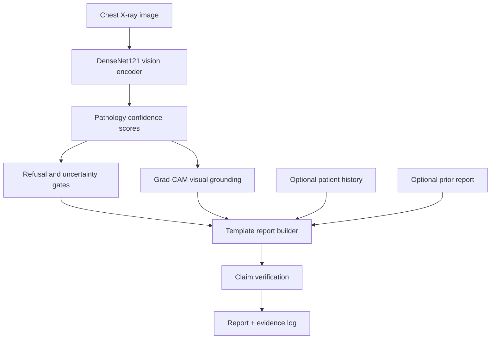

# ClinicGuard ReportGen

Evidence-grounded radiology report generation prototype with claim-level verification,
source traceability, controlled refusal for unsupported findings, and penalty-weighted
evaluation utilities.

This repository is a research and engineering prototype. It is not a clinical product,
does not claim diagnostic accuracy, and should not be used for patient care.

## What It Solves

- Reduces unsupported report text by generating from confidence-gated templates instead
  of unconstrained free text.
- Links generated claims to evidence sources such as image regions, patient history, or
  prior report text.
- Refuses or hedges findings when model confidence is below configurable thresholds.
- Produces CSV evidence logs so outputs can be audited claim by claim.
- Provides a Streamlit demo, command-line inference, evaluation helpers, and sample data
  for local experimentation.

## Current Scope

The runnable path uses an IU X-Ray style workflow and local sample cases. The MIMIC-CXR
and PadChest loaders are documented as access-controlled extensions because those datasets
require external approvals. If model weights or external datasets are unavailable, parts
of the app and loaders intentionally fall back to sample/demo behavior so the project can
still be inspected offline.

The included `reports/GROUNDING_EVIDENCE_LOG.csv` is a small sample evidence log with
10 claim-level rows. The included benchmark CSV is a sample artifact, not a clinical
benchmark claim.

## Quick Start

```bash
git clone https://github.com/hasana157/ClinicGuard-ReportGen.git
cd ClinicGuard-ReportGen
python -m venv .venv
source .venv/bin/activate
pip install -r requirements.txt
```

On Windows PowerShell:

```powershell
python -m venv .venv
.\.venv\Scripts\Activate.ps1
pip install -r requirements.txt
```

Generate or refresh the bundled sample cases:

```bash
python scripts/generate_sample_data.py
```

Run the web demo:

```bash
streamlit run app.py
```

Run inference on a sample X-ray:

```bash
python scripts/inference.py \
  --image data/sample_cases/chest_xray.png \
  --history data/sample_cases/patient_history.json \
  --prior data/sample_cases/prior_report.txt \
  --output results/
```

## Main Workflows

### Download Public Sample Dataset

```bash
python scripts/download_datasets.py --iu-xray
```

For MIMIC-CXR or PadChest, use:

```bash
python scripts/download_datasets.py --mimic
python scripts/download_datasets.py --padchest
```

Those commands print access instructions instead of pretending the protected datasets can
be downloaded automatically.

### Train

```bash
python scripts/train.py --epochs 10 --batch-size 8 --lr 1e-4
```

### Evaluate

```bash
python scripts/evaluate.py --num-samples 10 --output-dir evaluation/
```

Evaluation writes:

- `evaluation/benchmark_results.csv`
- `reports/GROUNDING_EVIDENCE_LOG.csv`
- sample generated reports and grounding overlays under `evaluation/sample_outputs/`

## Architecture



## Project Structure

```text
ClinicGuard-ReportGen/
|-- app.py                         # Streamlit demo
|-- requirements.txt               # Python dependencies
|-- setup.py                       # Package metadata
|-- src/
|   |-- config.py                  # Paths, labels, thresholds
|   |-- data_loader.py             # IU X-Ray loader and protected dataset stubs
|   |-- preprocessing.py           # Image and report preprocessing
|   |-- vision_encoder.py          # DenseNet121 feature extractor
|   |-- grounding_module.py        # Grad-CAM heatmaps and boxes
|   |-- report_generator.py        # Constrained generation pipeline
|   |-- report_templates.py        # Report templates
|   |-- hallucination_detector.py  # Claim verification
|   |-- uncertainty_quantifier.py  # MC dropout uncertainty helpers
|   |-- evaluation.py              # Evaluation suite
|-- scripts/
|   |-- download_datasets.py       # Dataset access helpers
|   |-- generate_sample_data.py    # Local sample data generation
|   |-- train.py                   # Training CLI
|   |-- inference.py               # Inference CLI
|   |-- evaluate.py                # Evaluation CLI
|   |-- generate_pdfs.py           # Markdown-to-PDF report generation
|-- data/sample_cases/             # Small local sample inputs
|-- evaluation/                    # Sample benchmark artifacts
|-- reports/                       # Technical notes and sample evidence log
|-- notebooks/                     # Exploratory walkthroughs
```

## Evidence Log Format

Each generated claim is recorded with:

- `sample_id`
- `generated_claim`
- `source_type`
- `source_reference`
- `confidence_score`
- `hallucinated`

Example:

```csv
sample_id,generated_claim,source_type,source_reference,confidence_score,hallucinated
001,Cardiomegaly present,visual,image_region_bbox:[100,150,250,300],0.94,False
```

## Resolved Cleanup Items

- Replaced placeholder clone instructions with the real repository URL.
- Removed stale external-context wording from public documentation.
- Reframed metrics as sample artifacts unless produced by a reproducible evaluation run.
- Clarified that the bundled evidence log has 10 sample rows, not hundreds of claims.
- Added the missing OpenCV dependency required by visual grounding.
- Fixed missing runtime imports in CLI scripts.
- Updated package metadata to match the repository name and URL.

## Limitations

- This is a prototype for grounded report-generation workflows, not a validated diagnostic
  system.
- Grad-CAM localization is an interpretability aid, not expert segmentation.
- The default local flow uses sample/IU-style data. Protected datasets require external
  approval and manual setup.
- Demo fallback outputs are for UI inspection when model weights or dependencies are not
  available.

## License

MIT License. See `LICENSE`.
