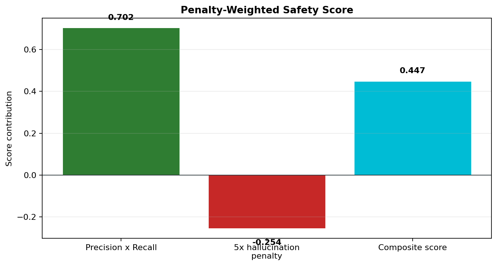

# Hallucination and Constraint Satisfaction Report

**Generated:** 2026-06-12
**Scope:** Offline sample audit for the ClinicGuard-ReportGen prototype.
**Clinical status:** Research and education only; not for diagnosis.

## Summary

This report documents how ClinicGuard reduces unsupported claims and how the current repository reports hallucination-related metrics. The expanded evidence log contains 75 claim-level rows across 10 bundled sample cases.

| Measure | Value |
| --- | ---: |
| Generated claim rows | 59 |
| Protective refusals | 16 |
| Flagged hallucinated generated claims | 3 |
| Sample hallucination flag rate | 5.1% |
| Grounded reference rate | 94.9% |
| Visual grounding rate | 100.0% |
| Average generated-claim confidence | 82.1% |


## Definition

In this project, a hallucination is a generated clinical assertion that is not supported by visual evidence, patient history, or prior report text. A claim is flagged when it asserts a finding but the available sources are insufficient.

## Constraint Satisfaction Strategy

ClinicGuard uses three safety controls:

- **Confidence-gated assertions:** Findings above 0.75 can be asserted.
- **Hedged uncertainty:** Findings between 0.50 and 0.75 are written with cautious language.
- **Protective refusal:** Findings below 0.50 are not asserted and are logged as refused/not generated.


## Evidence Log Schema

| Column | Meaning |
| --- | --- |
| `sample_id` | Stable case identifier. |
| `generated_claim` | Claim text or refusal statement. |
| `source_type` | `visual`, `history`, `prior`, `refusal_gate`, or `UNGROUNDED`. |
| `source_reference` | Concrete source pointer such as bbox, global assessment, or input text reference. |
| `confidence_score` | Model or verifier confidence associated with the row. |
| `hallucinated` | Boolean flag for unsupported generated claims. |
| `finding` | Pathology or evidence category. |
| `decision` | `asserted`, `hedged`, `negative`, `refused`, `context`, or `flagged_hallucination`. |
| `verification_note` | Human-readable review note. |

## Flagged Claims

| Sample | Flagged claim | Finding | Confidence | Review note |
| --- | --- | --- | ---: | --- |
| CASE-001 | Large right upper lobe mass | Mass | 0.21 | Detector flags this as unsupported by visual, history, or prior evidence. |
| CASE-005 | Definite pulmonary edema | Edema | 0.37 | Detector flags this as unsupported by visual, history, or prior evidence. |
| CASE-007 | Moderate pleural effusion | Effusion | 0.39 | Detector flags this as unsupported by visual, history, or prior evidence. |

## Confidence and Refusal Behavior


Rows below the uncertainty threshold are not forced into the report. This is a meaningful safety behavior: refusing a low-evidence finding is better than producing a fluent but unsupported statement.

## Penalty-Weighted Scoring

The sample report uses the implemented score form:

```text
Composite Score = (Precision * Recall) - (5 * Hallucination Rate)
```

The 5x penalty makes unsupported clinical assertions more costly than ordinary text overlap errors.

| Component | Value |
| --- | ---: |
| Precision | 0.885 |
| Recall | 0.793 |
| Precision x Recall | 0.702 |
| Hallucination rate | 0.051 |
| 5x hallucination penalty | 0.254 |
| Composite score | 0.447 |



## Claim Verification Flow


## Dashboard Evidence

The dashboard exposes the same evidence trail interactively.


## Reproduce

Regenerate the evidence log, plots, Markdown reports, and PDFs:

```bash
python scripts/generate_report_artifacts.py
```

For a real benchmark, run `scripts/evaluate.py --dataset MIMIC-CXR` or `scripts/evaluate.py --dataset PADCHEST` after configuring approved datasets and model checkpoints. Replace the sample audit with the exported benchmark rows before making clinical performance claims.

## Limitations

- This report is an offline sample audit and should not be described as a clinical benchmark.
- The bundled sample cases are intended to prove pipeline behavior and deliverable format.
- Protected medical datasets require approval and local credentials.
- Grad-CAM boxes explain model attention but do not equal ground-truth anatomic annotations.
