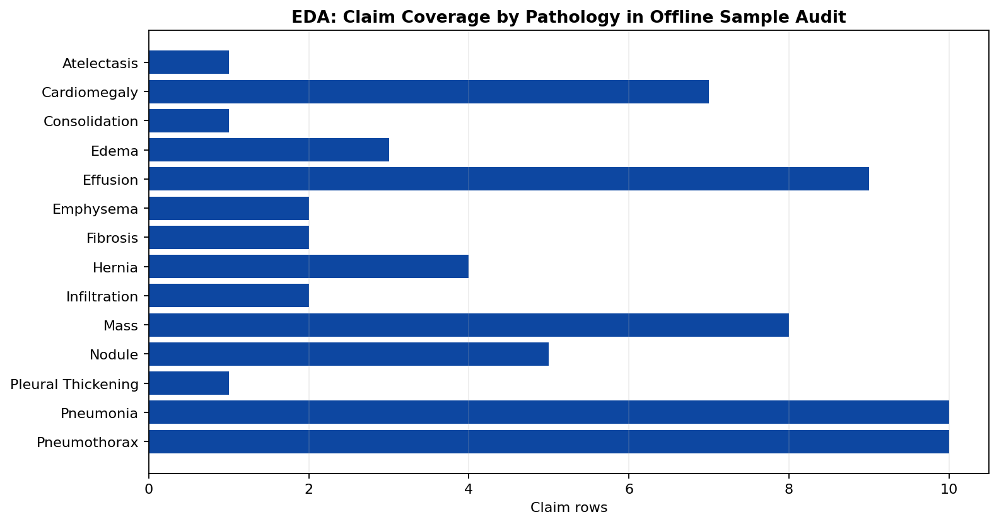
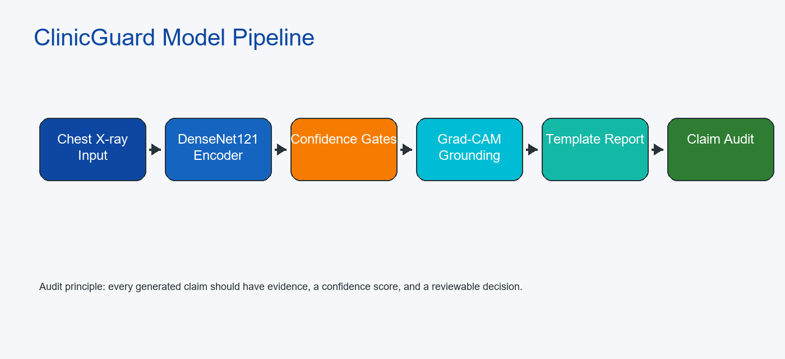
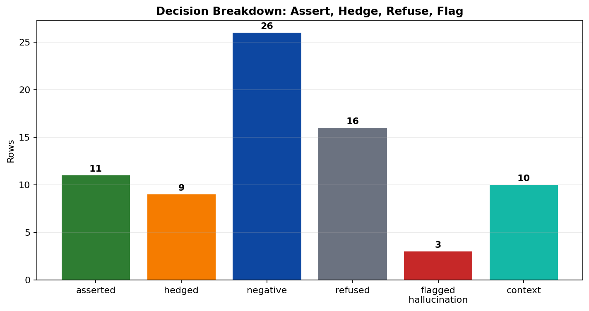
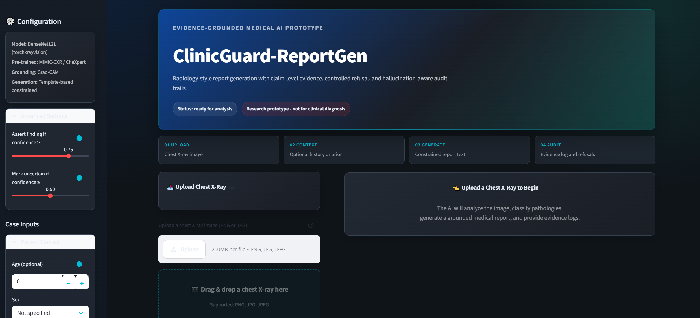
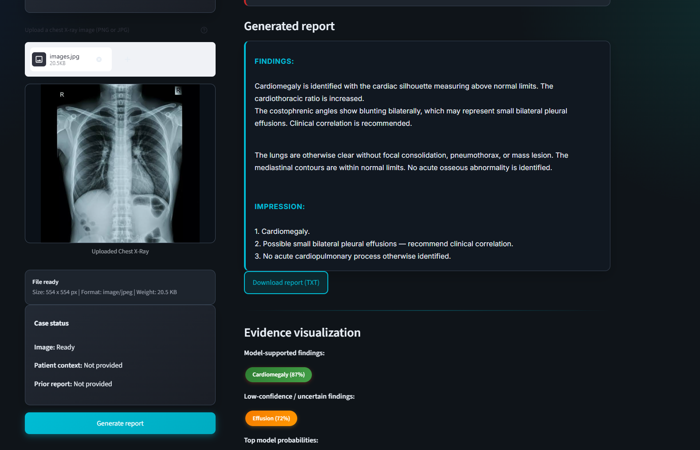
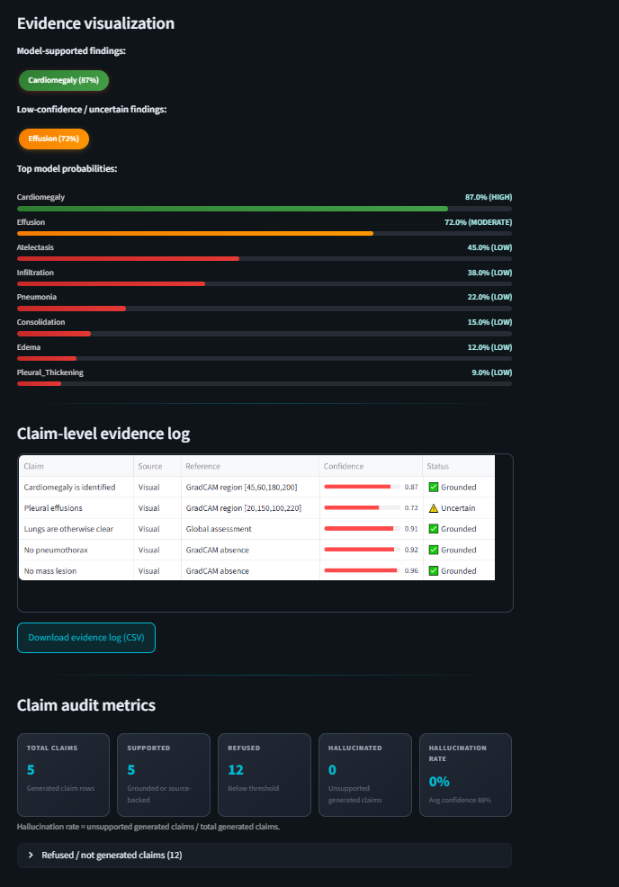
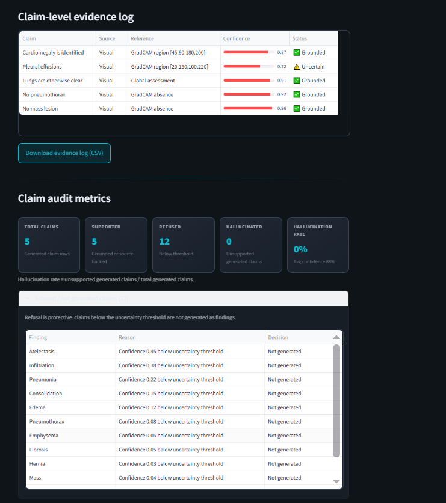
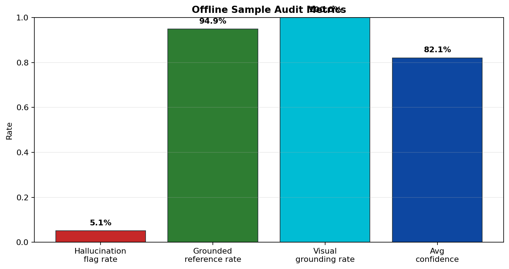
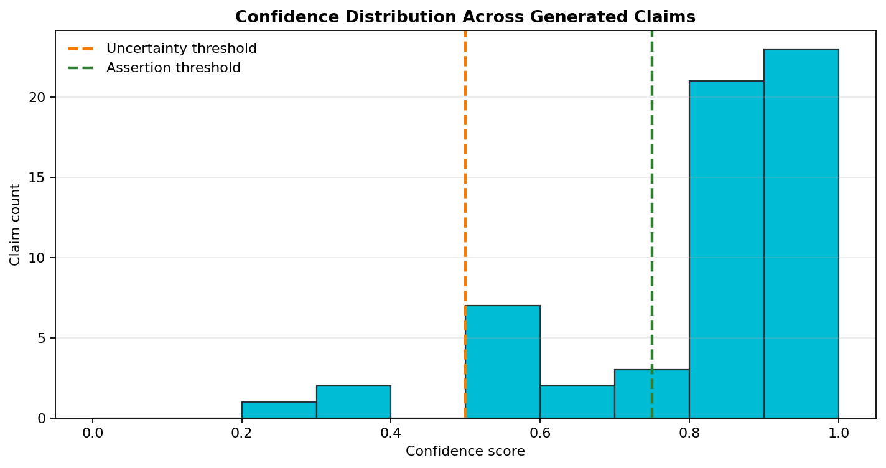
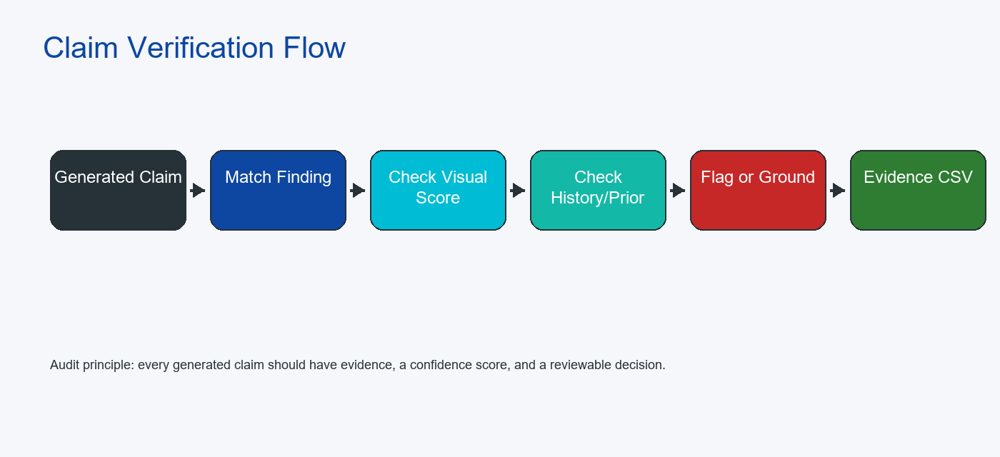

# ClinicGuard-ReportGen Technical Report

**Generated:** 2026-06-12
**Project type:** Evidence-grounded chest X-ray report generation prototype.
**Clinical status:** Research and education only; not for diagnosis.

## 1. Problem Statement

Medical report generation systems can produce fluent text that looks clinically plausible even when the claim is not supported by the image. In radiology, this is dangerous because an unsupported statement may become a false finding, a missed abnormality, or an incorrect impression. The core problem addressed by ClinicGuard-ReportGen is therefore not only generating a chest X-ray report, but generating a report whose claims can be traced, audited, and refused when evidence is weak.

The project focuses on three practical issues:

- Chest X-ray findings must be linked to model confidence scores and visual regions.
- Low-confidence findings should be hedged or refused instead of being forced into a report.
- Every generated claim should be captured in a claim-level evidence log for review.

## 2. Project Objectives

| Objective | Implementation in Repository |
| --- | --- |
| Generate structured radiology-style reports | `src/report_templates.py` and `src/report_generator.py` build INDICATION, COMPARISON, FINDINGS, and IMPRESSION sections. |
| Classify common chest X-ray findings | `src/vision_encoder.py` maps model outputs to 14 pathology labels. |
| Ground findings to image regions | `src/grounding_module.py` generates Grad-CAM heatmaps and bounding-box references. |
| Refuse unsupported claims | Confidence thresholds split outputs into asserted, hedged, negative, and refused decisions. |
| Measure hallucination risk | `src/hallucination_detector.py` verifies generated claims against visual, history, and prior-report evidence. |
| Provide reviewer-facing interface | `app.py` provides a Streamlit dashboard for upload, report generation, evidence logs, and metrics. |
| Produce deliverable reports | `scripts/generate_report_artifacts.py` regenerates Markdown reports, PDFs, metrics, plots, and evidence logs. |

## 3. Dataset Used

The repository is configured around protected target datasets while still supporting local sample cases and a free IU X-Ray fallback for offline testing. Restricted medical datasets are not bundled.

| Dataset / Source | Use in Project | Notes |
| --- | --- | --- |
| MIMIC-CXR | Primary target training/evaluation path | Configure `MIMIC_CXR_PATH` or `config.data.mimic_cxr_path` after PhysioNet approval. |
| PadChest | Alternative target training/evaluation path | Configure `PADCHEST_PATH` or `config.data.padchest_path` after BIMCV approval. |
| IU X-Ray | Free fallback/demo path | Use `--dataset IU-XRAY`; HuggingFace loading has a mock fallback for offline smoke tests. |
| Local sample cases | Immediate offline dashboard and artifact testing | Stored under `data/sample_cases/`. |
| MIMIC-CXR / CheXpert weights | Used indirectly through torchxrayvision DenseNet weights when available | Model weights are for feature initialization, not proof of local clinical validation. |

The current report metrics are generated from an offline sample audit with 75 claim-level rows. These metrics demonstrate pipeline behavior and deliverable format; they are not claimed as a clinical benchmark.

## 4. Data Preprocessing

The preprocessing path is implemented in `src/vision_encoder.preprocess_for_model` and the dataset utilities in `src/data_loader.py`.

| Step | Details |
| --- | --- |
| Image conversion | Chest X-ray images are converted to grayscale. |
| Resize | Images are resized to 224 x 224 pixels for DenseNet-style input. |
| Intensity scaling | Pixel values are normalized then rescaled to the torchxrayvision style range. |
| Channel handling | The grayscale image is repeated into 3 channels to match DenseNet input shape. |
| Label extraction | Report text is parsed using pathology synonym dictionaries in `src/data_loader.py`. |
| Split handling | Dataset loaders support train, validation, and test splits with deterministic fallback behavior. |

The model input tensor shape is `(1, 3, 224, 224)` during single-image inference.

## 5. Exploratory Data Analysis

EDA is included to show how claim coverage and pathology distribution are inspected before interpreting evaluation metrics. The offline sample audit covers the main chest X-ray findings used by the report generator.



The EDA view helps answer:

- Which pathologies appear most often in generated/audited claims?
- Whether the sample audit covers high-risk findings such as pneumothorax, pneumonia, effusion, mass, and cardiomegaly.
- Whether refusal behavior is present for low-confidence findings.

## 6. Built-in Models and Baseline Architecture



| Component | Model / Method | Purpose |
| --- | --- | --- |
| Vision backbone | DenseNet121 through torchxrayvision when available | Extract chest X-ray visual features. |
| Offline fallback | torchvision DenseNet121 | Keep the app and code path runnable when medical weights are unavailable. |
| Classification head | Linear layer over DenseNet features | Predict 14 pathology probabilities. |
| Grounding | Grad-CAM with fallback heatmaps | Produce heatmaps and bounding boxes for visual findings. |
| Report generation | Template-based constrained generation | Avoid unsupported open-ended prose. |
| Hallucination detector | Rule-based claim verification with synonym matching | Flag unsupported generated claims. |

The 14 supported pathology labels are: Atelectasis, Cardiomegaly, Consolidation, Edema, Effusion, Emphysema, Fibrosis, Hernia, Infiltration, Mass, Nodule, Pleural Thickening, Pneumonia, Pneumothorax.

## 7. Model Training Pipeline

The training entry point is `scripts/train.py`; configuration values are centralized in `src/config.py`.

| Training Setting | Default |
| --- | ---: |
| Batch size | 16 |
| Learning rate | 1e-4 |
| Weight decay | 1e-5 |
| Epochs | 30 |
| Early stopping patience | 5 |
| Scheduler | Cosine |
| Mixed precision | Enabled |
| Checkpoint directory | `models/` |

The intended training loop is:

1. Load image/report pairs through `MedicalReportDataset` with `--dataset MIMIC-CXR`, `--dataset PADCHEST`, or `--dataset IU-XRAY`.
2. Extract labels from report text using pathology synonyms.
3. Apply preprocessing and batching.
4. Fine-tune the DenseNet-based classifier.
5. Save the best checkpoint to `models/best_model.pt`.
6. Use the checkpoint in the dashboard and inference script when present.

If `models/best_model.pt` is absent, the dashboard explicitly falls back to demo mode instead of pretending a fine-tuned model exists.

## 8. Report Generation and Refusal Logic

The report generator uses confidence thresholds to decide how each finding should appear in the final report.

| Gate | Default | Report Behavior |
| --- | ---: | --- |
| Assertion threshold | 0.75 | Finding is written as present. |
| Uncertainty threshold | 0.50 | Finding is written with hedged language. |
| Refusal region | < 0.50 | Finding is not asserted and is logged as refused. |

This produces four audit decisions:

- `asserted`: model confidence supports a positive finding.
- `hedged`: confidence is not strong enough for certainty.
- `negative`: report states the absence of a finding.
- `refused`: the system avoids generating a weak finding.



## 9. Interface and Dashboard

The Streamlit interface in `app.py` is designed as a reviewer-facing dashboard. The left pane handles image upload, preview, and case status. The right pane shows generated report text, evidence visualization, evidence logs, metrics, and refused claims.





The dashboard supports:

- Chest X-ray upload and preview.
- Optional patient context and prior report input.
- One-click report generation.
- Confidence bars for top pathology probabilities.
- Claim-level evidence table with source references.
- Downloadable report text and evidence CSV.
- Demo mode when the fine-tuned checkpoint is not available.

## 10. Visual Grounding and Evidence Log

Grounding is implemented in `src/grounding_module.py`. For each reportable finding, the module produces a heatmap and extracts a bounding box from the strongest activation region. The evidence log stores these references as strings such as `image_region_bbox:[92,132,276,336]`.



The evidence log is the central audit artifact. It records:

- sample ID,
- generated claim,
- source type,
- source reference,
- confidence score,
- hallucination flag,
- finding name,
- audit decision,
- verification note.



## 11. Hallucination Detection and Metrics

The hallucination detector extracts claims from generated text and checks whether each claim is supported by:

- visual confidence scores,
- image-region references,
- patient history,
- prior report text.

Unsupported positive claims are marked as `UNGROUNDED` and `hallucinated=True`.

| Metric | Value |
| --- | ---: |
| Claim-level evidence rows | 75 |
| Generated claim rows | 59 |
| Refused / not generated rows | 16 |
| Flagged hallucinations | 3 |
| Sample hallucination flag rate | 5.1% |
| Grounded reference rate | 94.9% |
| Visual grounding rate | 100.0% |
| Average generated-claim confidence | 82.1% |
| Sample precision | 0.885 |
| Sample recall | 0.793 |
| Sample F1 | 0.836 |
| Penalty-weighted composite score | 0.447 |





The penalty-weighted score is:

```text
Composite Score = (Precision * Recall) - (5 * Hallucination Rate)
```

The 5x penalty makes unsupported clinical assertions more costly than ordinary misses.

## 12. Claim Audit Flow



The flow is:

1. Generate report text from confidence-gated templates.
2. Extract clinical claims from report sections.
3. Match claims to pathology synonyms.
4. Check visual confidence and source references.
5. Check patient history and prior report text.
6. Mark the claim as grounded, hedged, refused, or hallucinated.
7. Export the decision into `reports/GROUNDING_EVIDENCE_LOG.csv`.

## 13. Reproducibility

Run the dashboard:

```bash
streamlit run app.py
```

Regenerate report artifacts:

```bash
python scripts/generate_report_artifacts.py
```

Run the benchmark script when approved data and checkpoints are available:

```bash
python scripts/evaluate.py --dataset MIMIC-CXR --num-samples 50 --output-dir evaluation/
```

## 14. Limitations and Future Work

- The included metrics are an offline sample audit, not a clinical benchmark.
- Primary target datasets are MIMIC-CXR and PadChest, and both require manual approval and local setup.
- IU X-Ray is an explicit free fallback for smoke tests, not a substitute for protected-dataset benchmark claims.
- Grad-CAM regions are explanatory approximations, not radiologist segmentation labels.
- The app can fall back to demo mode if the fine-tuned checkpoint is not present.
- Template-based generation is safer and more auditable than open-ended prose, but less expressive.
- Future work should add real benchmark exports, calibration plots from approved datasets, and richer per-case PDF examples.

## 15. Deliverable Map

| File | Purpose |
| --- | --- |
| `reports/TECHNICAL_REPORT.md` | Full technical report source. |
| `reports/TECHNICAL_REPORT.pdf` | PDF technical report with screenshots, diagrams, EDA, and plots. |
| `reports/HALLUCINATION_ANALYSIS.md` | Hallucination/refusal analysis source. |
| `reports/HALLUCINATION_ANALYSIS.pdf` | PDF hallucination report with metrics and plots. |
| `reports/GROUNDING_EVIDENCE_LOG.csv` | Expanded claim-level evidence audit log. |
| `evaluation/benchmark_results.csv` | Numeric sample-audit summary. |
| `reports/assets/` | Dashboard screenshots, EDA plots, metrics plots, and flowcharts. |
